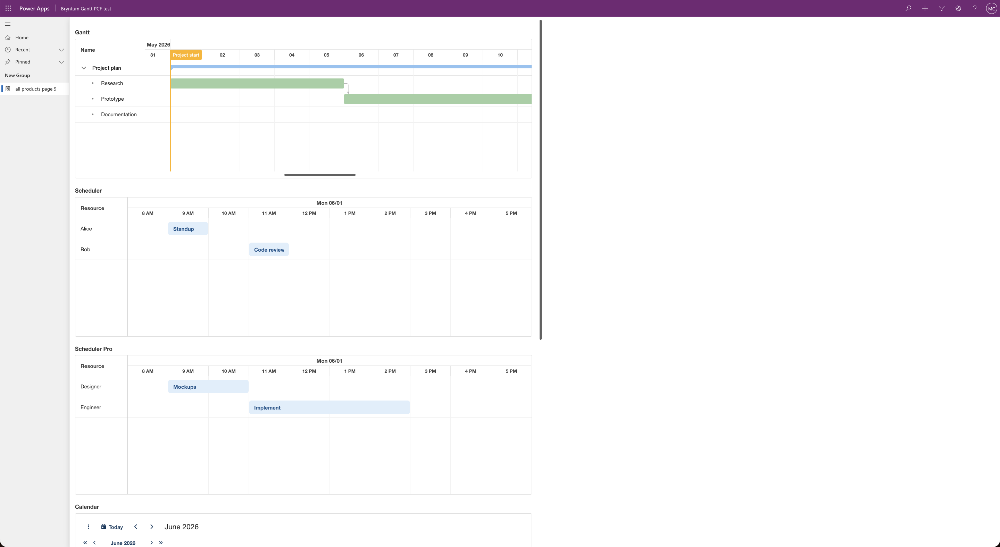

# Demo showing all Bryntum components in a single Power Apps component framework React component

Demo of one PCF component that uses all 6 Bryntum products. Total PCF bundle size = ~6 KiB. This is achieved by hosting [Bryntum thin packages](https://bryntum.com/products/gantt/docs/guide/Gantt/integration/javascript/multiple-products) as Dataverse web resources (4.16 MiB single web resource).

### Why a single all-products PCF can't bundle Bryntum inline

It is **5.45 MiB** (all bryntum products), including PCF code, which is over the 5 MB default upload size limit.

For reference, individual product builds in production mode:
- Gantt alone (umbrella `@bryntum/gantt`): 3.87 MiB
- Gantt alone (thin): 3.71 MiB

So you need to move Bryntum library code out of the PCF, or split into multiple PCFs (one Bryntum component per PCF). Here are 2 options:

### Option 1 (recommended): Bryntum as a Dataverse web resource, PCFs reference using `window.bryntum`

We built and verified this end-to-end — all 6 Bryntum products render on the same Power Apps app page from a single PCF:



There are two folders in this GitHub repo:

1. **`bryntum-shared`** — a standalone webpack project that bundles all Bryntum thin packages into a single `bryntum.js` that you upload to Dataverse once. 
2. **`bryntum-power-apps-component`** — the PCF component itself. Its own bundle stays at ~6 KiB because Bryntum is loaded at runtime from the Dataverse web resource. 

### Bryntum version 6 to 7 changes

The PCF in `bryntum-power-apps-component` is adapted from [this blog post](https://bryntum.com/blog/how-to-build-a-react-gantt-chart-in-microsoft-power-apps-using-bryntum-power-apps-component-framework-and-dataverse/), which uses Bryntum v6. These example repos use Bryntum v7.3, which changes a few things relative to the blog:

- **Theme**: blog uses `gantt.stockholm.css` (the v6 single-file theme format). This repo uses `svalbard-light.min.css` — Bryntum's [default theme in v7](https://bryntum.com/products/gantt/docs/guide/Gantt/quick-start/javascript#stylesheets). Both repos in this guide load Svalbard Light; swap for any other v7 theme by replacing `svalbard-light.min.css` with `stockholm-light.min.css`, `material3-light.min.css`, etc.
- **CSS split into multiple files**: v6 ships one combined `gantt.stockholm.css` per theme that bundles structural styles + theme + FontAwesome together. v7 splits them apart — you need to import the structural CSS, the theme, and FontAwesome separately, in that order. That's why the manifest has 10 CSS entries instead of 1 (see Step 3 below).
- **FontAwesome no longer auto-bundled**: v6 included icon webfonts inside its theme CSS. v7 requires you to import `fontawesome.min.css` + `solid.min.css` explicitly and either bundle the webfont files or point the `@font-face src` at a CDN.
- **Thin packages**: blog uses the umbrella `@bryntum/gantt` package. This repo uses `@bryntum/*-thin` packages so multiple Bryntum products can coexist on one page without the "bundle loaded multiple times" error (see Option 2 caveat below).

### Architecture

```
Dataverse environment
├─ Web resource: /WebResources/test_bryntum.js   ← 4.16 MiB, uploaded once
│  └─ exposes window.bryntum.{core, engine, grid, scheduler, schedulerpro, gantt, calendar, taskboard}
│
└─ PCF code components
   └─ All-products demo PCF — bundle.js is just ~6 KiB (loader + React mount logic)
```

All PCFs in the environment fetch the same web resource → browser caches it once → second PCF on the same page sees `window.bryntum` already exists and skips loading. Multiple Bryntum products on the same page work fine because there's only one Bryntum module graph in memory.

### Steps to run the demo

#### Step 1 — Build the shared bundle (`bryntum-shared`)

The `bryntum-shared` folder contains:

- `package.json` — all 8 Bryntum thin packages installed as dependencies (`@bryntum/core-thin`, `engine-thin`, `grid-thin`, `scheduler-thin`, `schedulerpro-thin`, `gantt-thin`, `calendar-thin`, `taskboard-thin`)
- `src/all.js` — imports each thin package + its English locale, assigns to `window.bryntum`
- `webpack.config.js` — bundles everything into `dist/bryntum.js`
- `npm run build` webpack bundling script, which outputs `bryntum-shared/dist/bryntum.js`

Install and build:

```bash
cd bryntum-shared
npm install
npm run build
```

`dist/bryntum.js` will be ~4.16 MiB.

**Key things `src/all.js` does**:

```js
// 1. Import the thin packages.
import * as core from '@bryntum/core-thin';
// ...other 7 thin packages

// 2. Register English locales — thin packages don't auto-load any locale,
// without these Bryntum renders `L{Name}` placeholders and throws
// "this.L(...) is not a function" during render.
import '@bryntum/core-thin/locales/core.locale.En.js';
// ...other 6 locales

// 3. MERGE into window.bryntum (don't overwrite). The locale imports above
// register themselves on window.bryntum.locales via Bryntum's LocaleHelper.
// A naive `window.bryntum = {...}` would wipe the locales registry.
window.bryntum = Object.assign(window.bryntum || {}, {
  core, engine, grid, scheduler, schedulerpro, gantt, calendar, taskboard,
});
```

**Key thing `webpack.config.js` does** — declares the locale files as side-effectful so webpack production mode doesn't tree-shake them:

```js
module: {
  rules: [{ test: /\.locale\.[A-Za-z]+\.js$/, sideEffects: true }],
},
```

The locale files are UMD-wrapped and have no ESM exports. Without this rule, webpack 5 silently drops the import and you'll see `L{Name}` placeholders in the rendered UI.

---

#### Step 2 — Upload `bryntum.js` to Dataverse as a web resource

1. Go to <https://make.powerapps.com> → select your environment in the top-right nav
2. In the left nav → click on **Solutions** 
3. Click **+ New solution**, display name: Bryntum, name Bryntum, create new publisher called bryntum, with prefix 'test'
**+ New** → **More** → **Web resource**
4. In the **Objects** page that opens, click down arrow to the right of **+ New** button at top left > click More > Web resource
5. upload the bryntum-shared/dist/bryntum.js file. 
   Fill in:
   - **File type**: `JavaScript`
   - **Name**: `bryntum.js` (becomes prefixed → `test_bryntum.js`)
   - **Display name**: `Bryntum library` (anything readable)
6. **Save**
7. Back at the solution view: click **Publish all customizations** at the top left (needed because saving alone doesn't expose the URL)

Verify it's reachable by visiting the URL in your browser:

```
https://<your-env>.crm4.dynamics.com/WebResources/test_bryntum.js
```

You should see the minified JS.

> This URL is hardcoded in `bryntum-power-apps-component/Bryntum/AllProducts.tsx`. At the top is the constant `BRYNTUM_SCRIPT_URL = '/WebResources/test_bryntum.js'`. If your publisher prefix isn't `test`, update that line.

To update Bryntum later: re-upload the file via the same web resource (use **Replace file**, don't create a new one) → Publish all customizations. All PCFs in the environment immediately get the new version.


#### Step 3 — Build and push the PCF (`bryntum-power-apps-component`)

```bash
cd bryntum-power-apps-component
npm install
pac pcf push --publisher-prefix test
```

This pushes a PCF whose `bundle.js` is only ~6 KiB. The Bryntum CSS files come along with it as separate resources.

**About the CSS**: the files in `bryntum-power-apps-component/Bryntum/css/` were copied from the Bryntum Gantt distribution download (available from https://customerzone.bryntum.com/) (the `build/thin-min/` and `resources/fontawesome/css/` folders). They include the thin per-product CSS (`gantt.thin.min.css`, etc.), the FontAwesome icon CSS, and the `svalbard-light.min.css` theme — based on the structure described in [Bryntum's quick-start guide](https://bryntum.com/products/gantt/docs/guide/Gantt/quick-start/javascript). They're registered in `Bryntum/ControlManifest.Input.xml` and loaded in order at PCF mount time:

```xml
<resources>
  <code path="index.ts" order="1"/>
  <platform-library name="React" version="16.8.6" />
  <css path="css/AllProducts.css"        order="1" />  <!-- layout/loader styles -->
  <css path="css/fontawesome.min.css"    order="2" />  <!-- icon framework -->
  <css path="css/solid.min.css"          order="3" />  <!-- icon font (loads from FA CDN) -->
  <css path="css/core.thin.min.css"      order="4" />  <!-- Bryntum structural CSS -->
  <css path="css/grid.thin.min.css"      order="5" />
  <css path="css/scheduler.thin.min.css" order="6" />
  <css path="css/schedulerpro.thin.min.css" order="7" />
  <css path="css/gantt.thin.min.css"     order="8" />
  <css path="css/calendar.thin.min.css"  order="9" />
  <css path="css/taskboard.thin.min.css" order="10" />
  <css path="css/svalbard-light.min.css" order="11" /> <!-- theme overrides structural -->
</resources>
```

CSS load order matters — "AllProducts.css first (layout/loader), FontAwesome next, structural per-product CSS, theme last so it can override.

> **FontAwesome webfont:** by default `solid.min.css` references `https://use.fontawesome.com/...` for the icon webfont. If your environment blocks external CDN access, host the two webfont files (`fa-solid-900.woff2` + `.ttf`, ~150 KiB combined) as Dataverse web resources and rewrite the `@font-face src` URLs in `solid.min.css` to point at those.

---

#### Step 4 — Add the PCF to the Power Apps app

Follow the steps from the [blog post](https://bryntum.com/blog/how-to-build-a-react-gantt-chart-in-microsoft-power-apps-using-bryntum-power-apps-component-framework-and-dataverse/) (the section "Adding the Bryntum Gantt React component to the Power Apps app"):

1. Open your model-driven app → **Edit**
2. Add a custom page (or open an existing one)
3. **+ Insert** → **Get more components** → **Code** tab → import `Bryntum` (the component this PCF registers)
4. Drop it on the canvas → resize to fill the page
5. **Save** → **Back** → **Publish** → **Play**, then hard-refresh the page (Cmd/Ctrl+Shift+R)

On first load you'll see "Loading Bryntum…" briefly, then all 6 products render with inline sample data.


### Notes

`bryntum-power-apps-component/Bryntum/AllProducts.tsx` loads Bryntum from the web resource. 
The PCF's working pattern is: fetch the bundle as text, execute it in the current realm via `new Function(...)` with `window`/`self`/`globalThis` explicitly bound. Falls back to inline `<script textContent=...>` if `new Function` is blocked by CSP. The full implementation is in `AllProducts.tsx`.

**Render containers from the first render, not behind a loader.** Power Apps needs to lay them out before Bryntum mounts. If you conditionally render the containers only when `ready=true`, Bryntum reads `height=0` and renders empty shells on first load.

**Why no React wrapper (`@bryntum/*-react-thin`)?** Because the wrappers internally `import { ... } from '@bryntum/gantt-thin'` etc., so using them re-bundles Bryntum into the PCF — defeating the whole point of hosting Bryntum on Dataverse. To use the wrappers in this architecture, you'd need webpack `externals` config in the PCF to map `@bryntum/*-thin` to `window.bryntum.*`. Possible, but more setup. Mounting vanilla classes via `appendTo: ref.current` in `useEffect` is ~5 lines per product.

| Metric | Value |
|---|---|
| Shared `bryntum.js` web resource | 4.16 MiB (under 5 MB cap, no admin changes needed) |
| Per-PCF `bundle.js` | ~6 KiB |
| Products renderable simultaneously on same page | All 6 (Gantt + SchedulerPro + Scheduler + Calendar + TaskBoard + Grid) |
| External CDN dependencies | None (FontAwesome webfonts can be hosted on Dataverse too if external CDN is blocked) |
| Updating Bryntum | re-upload one web resource → all PCFs get the new version |

### Option 2: One PCF per product, multiple PCFs on the same page

If you want Gantt and Calendar (or any combination of products) on the same Power Apps page, build them as **separate PCFs** — one PCF per product — and add multiple PCFs to the same page.

For each PCF, install only the **thin packages** that PCF actually uses. Thin packages are required — per the [Bryntum docs on combining multiple products](https://bryntum.com/products/gantt/docs/guide/Gantt/integration/javascript/multiple-products):

> It is not possible to import several regular (non-thin) Bryntum npm packages like `@bryntum/grid` and `@bryntum/calendar` in one application. Doing this will lead to a runtime console error: **"The Bryntum Gantt bundle was loaded multiple times by the application."**

So for example:

- Gantt PCF: installs `@bryntum/core-thin`, `@bryntum/engine-thin`, `@bryntum/grid-thin`, `@bryntum/scheduler-thin`, `@bryntum/schedulerpro-thin`, `@bryntum/gantt-thin`. Bundle comes in around 3.7 MiB — under 5 MB.
- Calendar PCF: installs `@bryntum/core-thin`, `@bryntum/engine-thin`, `@bryntum/grid-thin`, `@bryntum/scheduler-thin`, `@bryntum/calendar-thin`. Bundle around 3 MiB — under 5 MB.
- Etc. for any other product.

Each PCF is self-contained, deploys independently with `pac pcf push`, and stays under the 5 MB cap because thin packages only include the layers their product depends on (for example, no unused Calendar/TaskBoard code dragged in by an umbrella package).

You add the Gantt PCF, the Calendar PCF, etc. as separate components on the same custom page in Power Apps — they render side-by-side.

**You don't need Option 1's Dataverse web resource for this case** — Bryntum stays bundled inside each PCF, no extra infrastructure to manage. Option 1 is only necessary when you want *all six products* in *one* PCF (which exceeds 5 MB).

- **Pro:** simplest architecture. No shared-bundle build step, no script injection, no realm/timing gotchas. Each PCF is independent.
- **Con:** code duplication across PCFs — every PCF carries its own copy of Core + Engine + Grid (small base layers). For a user opening a page with 3 PCFs, that's ~1 MiB of duplicated download, browser-cached per webresource URL.

### Recommendation

Pick based on what you need on a single page:

- **Need 4+ products simultaneously on one page, or want one place to update Bryntum** → Option 1 (Dataverse web resource).
- **Need 1–3 products per page, want the simplest setup** → Option 2 (one PCF per product).

The "private app with no external access" constraint is met by both. The one external dependency in the standard Bryntum CSS is `use.fontawesome.com` for the icon webfont — if that's also blocked, upload the two FontAwesome webfont files (~150 KiB combined) as Dataverse web resources and rewrite the `solid.css` `@font-face src` to point at those URLs.
